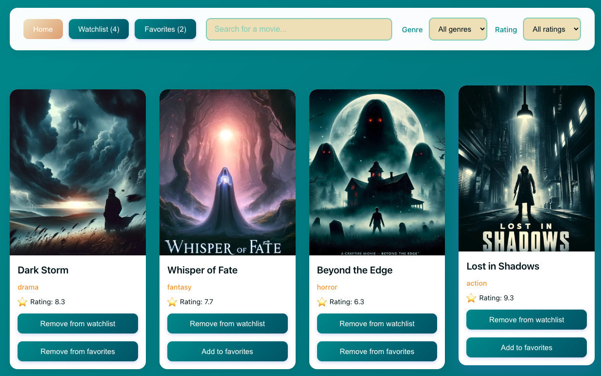
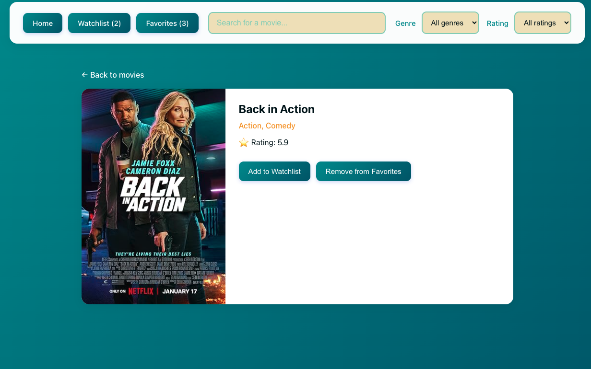

# Razvan Balan - React Movie app

## Functionalitati implementate
- lista cu movie cards
- loading state cu useEffect
- watchlist/favorites in localstorage
- sort by rating sau genre
- cautare film
- pagina detalii film
- fetch filme din API public  (pentru setup trebuie un api key de la https://www.omdbapi.com/)
- routing

## Pagina principala

## Pagina detalii

todo:
optimizare fetches 
poster css